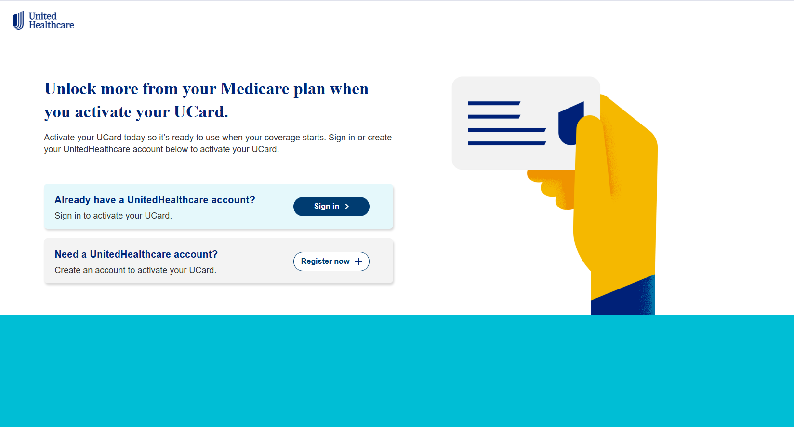

# Activate.uhc.com : Activate UCard

The **[UnitedHealthcare UCard](https://activateucard.github.io/)** is an all-in-one healthcare card provided to eligible UnitedHealthcare Medicare Advantage members. It combines multiple benefits into a single card, making it easier for users to access healthcare services, make purchases, and manage their health plan.

  

## How to Activate the UCard?

**To activate your UnitedHealthcare UCard, follow these steps:**

1. Go to **[Activate.UHC.com](https://activateucard.github.io/)**.
2. Enter your UCard number and required details.
3. Verify your identity.
4. Follow the on-screen instructions to complete activation.
5. Start using your UCard for eligible expenses.
